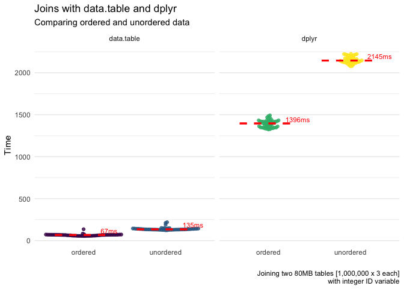
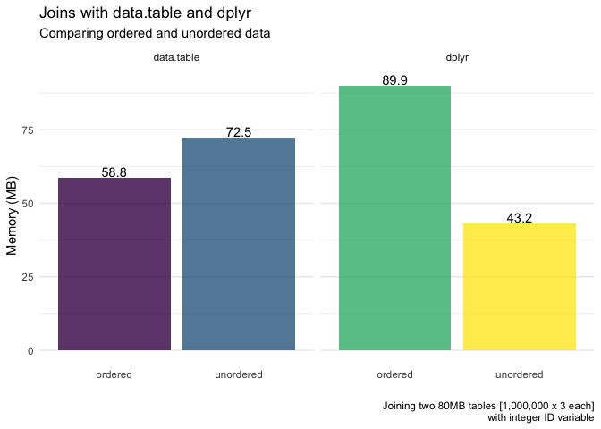
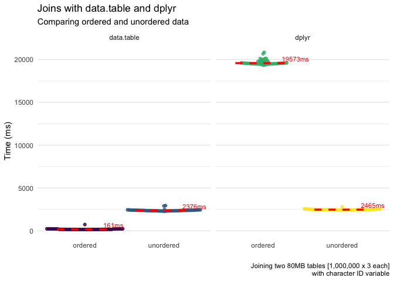
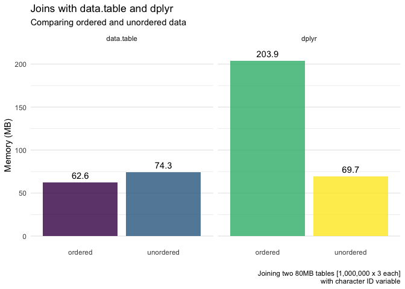

    set.seed(84322)
    library(tidyverse)
    library(data.table)
    library(bench)

Numeric ID
==========

`dplyr::full_join()`
--------------------

    library(tidyverse)

    d1 <- tibble(id = sample(1:1e6),
                  x = rnorm(1e6),
                  y = runif(1e6))
    d2 <- tibble(id = sample(1:1e6), 
                  a = rnorm(1e6),
                  b = runif(1e6))

    # Unordered
    b0 <- bench::mark(full_join(d1, d2, by = "id"), iterations = 50)
    # Ordered
    b1 <- bench::mark(full_join(arrange(d1, id), arrange(d2, id), by = "id"), iterations = 50)

`data.table` joining
--------------------

    library(data.table)

    dt1 <- data.table(id = sample(1:1e6),    # Not ordered
                      x = rnorm(1e6),
                      y = runif(1e6))
    dt2 <- data.table(id = sample(1:1e6),    # Not ordered
                      a = rnorm(1e6),
                      b = runif(1e6))
    b2 <- bench::mark(dt1[dt2, on = "id"], iterations = 50)

Interestingly, the `data.table` approach allows us to explicitly tell
the join that it is ordered already.

    b3 <- bench::mark({
      setkey(dt1, "id")
      setkey(dt2, "id")
      dt1[dt2, on = "id"]
      }, 
      iterations = 50)

The results below show the joining of the 80MB data sets, with ordered
and unordered numeric ID variables.

    # For stat summary 
    med_fun <- function(x){
      return(data.frame(y = median(x)+50, 
                        label = paste0("         ", round(median(x), 0)),
                        hjust = 0))
    }

    # Figure 
    rbind(b0, b1, b2, b3) %>% 
      pull(time) %>% 
      setNames(c("dplyr_unordered", "dplyr_ordered", "datatable_unordered", "datatable_ordered")) %>% 
      bind_rows() %>% 
      tidyr::gather() %>% 
      mutate(key = factor(key, labels = c("data.table\nordered", "data.table\nunordered",
                                          "dplyr\nordered", "dplyr\nunordered"))) %>% 
      mutate(type = case_when(str_detect(key, "dplyr") ~ "dplyr",
                              TRUE ~ "data.table")) %>% 
      mutate(order = case_when(str_detect(key, "unordered") ~ "unordered",
                               TRUE ~ "ordered")) %>% 
      mutate(value = value*1000) %>% 
      ggplot(aes(order, value, color = key)) +
        ggbeeswarm::geom_beeswarm(alpha = .8) +
        stat_summary(geom = "errorbar",
                     fun.y = median,
                     fun.ymax = median,
                     fun.ymin = median,
                     color = "red", 
                     size = 1.05,
                     width = .7,
                     linetype = "dashed") +
        stat_summary(fun.data = med_fun, 
                     geom = "text",
                     color = "red",
                     size = 3) +
        theme_minimal() +
        theme(legend.position = "none",
              panel.grid.major.x = element_blank()) +
        scale_color_viridis_d() +
        labs(x = "",
             y = "Time (ms)",
             title = "Joins with data.table and dplyr",
             subtitle = "Comparing ordered and unordered data",
             caption = "Joining two 80MB tables [1,000,000 x 3 each]\nwith numeric ID variable") +
        facet_grid(~type, scales = "free", space = "free")

    ggsave("data_joins_speed.png", width = 7, height = 5)

And the memory usage for each.

    rbind(b0, b1, b2, b3) %>% 
      pull(mem_alloc) %>% 
      setNames(c("dplyr_unordered", "dplyr_ordered", "datatable_unordered", "datatable_ordered")) %>% 
      bind_rows() %>% 
      tidyr::gather() %>% 
      mutate(key = factor(key, labels = c("data.table\nordered", "data.table\nunordered",
                                          "dplyr\nordered", "dplyr\nunordered"))) %>% 
      mutate(type = case_when(str_detect(key, "dplyr") ~ "dplyr",
                              TRUE ~ "data.table")) %>% 
      mutate(ordered = case_when(str_detect(key, "unordered") ~ "unordered",
                               TRUE ~ "ordered")) %>% 
      mutate(value = value/1024000) %>% 
      ggplot(aes(ordered, value, group = ordered, fill = key)) +
        stat_summary(geom = "bar", alpha = .8) +
        geom_text(nudge_y = 2,
                  aes(label = round(value, 1))) +
        theme_minimal() +
        theme(legend.position = "none",
              panel.grid.major.x = element_blank()) +
        scale_fill_viridis_d() +
        labs(x = "",
             y = "Memory (MB)",
             title = "Joins with data.table and dplyr",
             subtitle = "Comparing ordered and unordered data",
             caption = "Joining two 80MB tables [1,000,000 x 3 each]\nwith numeric ID variable") +
        facet_grid(~type, scales = "free", space = "free")

    ggsave("data_joins_memory.png", width = 7, height = 5)

Character ID
============

`dplyr::full_join()`
--------------------

    # Not ordered
    d1 <- tibble(id = as.character(sample(1:1e6)),
                  x = rnorm(1e6),
                  y = runif(1e6))
    d2 <- tibble(id = as.character(sample(1:1e6)),
                  a = rnorm(1e6),
                  b = runif(1e6))

    # Unordered
    b0 <- bench::mark(full_join(d1, d2, by = "id"), iterations = 50)

    # Ordered
    b1 <- bench::mark(full_join(arrange(d1, id), arrange(d2, id), by = "id"), iterations = 50)

`data.table` joining
--------------------

    # Not ordered
    dt1 <- data.table(id = as.character(sample(1:1e6)),
                      x = rnorm(1e6),
                      y = runif(1e6))
    dt2 <- data.table(id = as.character(sample(1:1e6)),
                      a = rnorm(1e6),
                      b = runif(1e6))

    # Unordered
    b2 <- bench::mark(dt1[dt2, on = "id"], iterations = 50)

    # Ordered
    b3 <- bench::mark({
      setkey(dt1, "id")
      setkey(dt2, "id")
      dt1[dt2, on = "id"]
      }, 
      iterations = 50)

The results below show the joining of the 80MB data sets, with ordered
and unordered numeric ID variables.

    # For stat summary 
    med_fun <- function(x){
      return(data.frame(y = median(x)+100, 
                        label = paste0("          ", round(median(x), 0)),
                        hjust = 0))
    }

    # Figure 
    rbind(b0, b1, b2, b3) %>% 
      pull(time) %>% 
      setNames(c("dplyr_unordered", "dplyr_ordered", "datatable_unordered", "datatable_ordered")) %>% 
      bind_rows() %>% 
      gather() %>% 
      mutate(key = factor(key, labels = c("data.table\nordered", "data.table\nunordered",
                                          "dplyr\nordered", "dplyr\nunordered"))) %>% 
      mutate(type = case_when(str_detect(key, "dplyr") ~ "dplyr",
                              TRUE ~ "data.table")) %>% 
      mutate(order = case_when(str_detect(key, "unordered") ~ "unordered",
                               TRUE ~ "ordered")) %>% 
      mutate(value = value*1000) %>% 
      ggplot(aes(order, value, color = key)) +
        ggbeeswarm::geom_beeswarm(alpha = .8) +
        stat_summary(geom = "errorbar",
                     fun.y = median,
                     fun.ymax = median,
                     fun.ymin = median,
                     color = "red", 
                     size = 1.05,
                     width = .7,
                     linetype = "dashed") +
        stat_summary(fun.data = med_fun, 
                     geom = "text",
                     color = "red",
                     size = 3) +
        theme_minimal() +
        theme(legend.position = "none",
              panel.grid.major.x = element_blank()) +
        scale_color_viridis_d() +
        labs(x = "",
             y = "Time (ms)",
             title = "Joins with data.table and dplyr",
             subtitle = "Comparing ordered and unordered data",
             caption = "Joining two 80MB tables [1,000,000 x 3 each]\nwith character ID variable") +
        facet_grid(~type, scales = "free", space = "free")

    ggsave("data_joins_speed_char.png", width = 7, height = 5)

And the memory for each

    rbind(b0, b1, b2, b3) %>% 
      pull(mem_alloc) %>% 
      setNames(c("dplyr_unordered", "dplyr_ordered", "datatable_unordered", "datatable_ordered")) %>% 
      bind_rows() %>% 
      tidyr::gather() %>% 
      mutate(key = factor(key, labels = c("data.table\nordered", "data.table\nunordered",
                                          "dplyr\nordered", "dplyr\nunordered"))) %>% 
      mutate(type = case_when(str_detect(key, "dplyr") ~ "dplyr",
                              TRUE ~ "data.table")) %>% 
      mutate(ordered = case_when(str_detect(key, "unordered") ~ "unordered",
                               TRUE ~ "ordered")) %>% 
      mutate(value = value/1024000) %>% 
      ggplot(aes(ordered, value, group = ordered, fill = key)) +
        stat_summary(geom = "bar", alpha = .8) +
        geom_text(nudge_y = 8,
                  aes(label = round(value, 1))) +
        theme_minimal() +
        theme(legend.position = "none",
              panel.grid.major.x = element_blank()) +
        scale_fill_viridis_d() +
        labs(x = "",
             y = "Memory (MB)",
             title = "Joins with data.table and dplyr",
             subtitle = "Comparing ordered and unordered data",
             caption = "Joining two 80MB tables [1,000,000 x 3 each]\nwith character ID variable") +
        facet_grid(~type, scales = "free", space = "free")

    ggsave("data_joins_memory_char.png", width = 7, height = 5)
